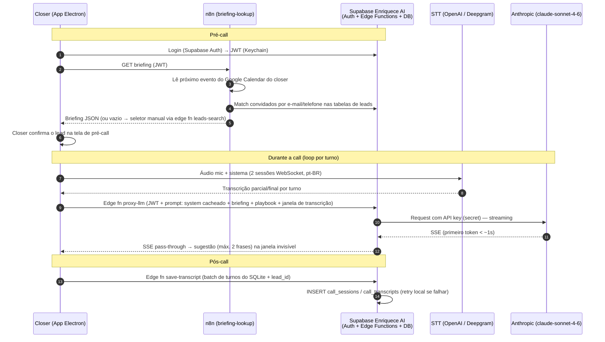

# Plano de Construção — Copiloto de Reuniões V4 Amaral&Co

> **Base:** fork do Pickle Glass (este repositório) · **Plataforma:** macOS · **LLM:** Claude `claude-sonnet-4-6` (streaming) · **Time:** 1 dev full-stack + PM validador · **Prazo:** piloto em 4 semanas (Semanas 2–5; Semana 1 de validação da fundação já concluída fora deste plano)
>
> Todas as referências de arquivo/linha abaixo foram verificadas no código real do fork.

---

## 1. Arquitetura técnica

### 1.1 Componentes e onde roda cada coisa

| Componente | Onde roda | Situação |
|---|---|---|
| Captura de áudio dos 2 lados (mic + sistema via binário `SystemAudioDump`), AEC, overlay invisível | **App Electron** | ✅ Já nativo do Glass. Invisibilidade: `setContentProtection(true)` é default em todas as janelas (`src/window/windowManager.js:31,408-424`) |
| Transcrição streaming (2 sessões: "Me" e "Them") | App → provider via WebSocket | ✅ Multi-provider já implementado (`src/features/common/ai/factory.js`). Nativa: OpenAI `gpt-4o-mini-transcribe`. Plano B: **Deepgram já implementado** (`src/features/common/ai/providers/deepgram.js`) — só ajustar idioma |
| Cérebro de sugestões (Claude, streaming) | App monta o prompt → **Edge Function Supabase `proxy-llm`** → Anthropic | 🔧 Anthropic já suportado no Glass (`providers/anthropic.js`); trocar modelo e rotear pelo proxy |
| Proxy de API keys (`proxy-llm`, `proxy-stt-token`) | **Edge Functions Supabase** (projeto `dhkmonctyoaenejemkrt`) | 🆕 Criar |
| Busca do briefing (Calendar → lead) | **n8n self-hosted** (webhook `briefing-lookup`) | 🆕 Criar — não é latência-crítico (roda no pré-call) |
| Busca manual de lead (fallback) | Edge Function `leads-search` | 🆕 Criar |
| Gravação da transcrição pós-call | Edge Function `save-transcript` → tabelas `call_sessions` / `call_transcripts` | 🆕 Criar. Fonte: SQLite local do Glass, que já salva turno a turno |
| Persistência local (sessões/transcrições) | SQLite (`~/Library/Application Support/Glass/pickleglass.db`) | ✅ Já funciona (`sttRepository.addTranscript()`) |

**Por que Edge Function (e não n8n) para o proxy de keys:** a Edge Function faz pass-through de streaming SSE nativamente (essencial para latência), valida o JWT do Supabase Auth sem código extra e roda na borda com cold start baixo. O n8n não lida bem com resposta streaming e adicionaria um hop; ele fica só com os fluxos assíncronos (briefing, notificações).

### 1.2 Como o app identifica o lead da reunião atual

1. **Automático (pré-call):** ao abrir a sessão, o app chama o webhook n8n `briefing-lookup` (autenticado com o JWT do closer). O n8n lê o **próximo evento** do Google Calendar do closer (credencial OAuth de cada closer cadastrada no n8n — viável para 2–10 usuários), extrai e-mails/telefones dos convidados e faz o match nas tabelas de leads do Enriquece AI (e-mail exato → telefone normalizado → domínio da empresa como desempate). Devolve o briefing em JSON; o app injeta no system prompt.
2. **Fallback manual:** sem match (ou match errado), o app abre um seletor com busca (nome/empresa/e-mail) via edge function `leads-search`.
3. **Regra de produto:** o lead identificado é **sempre exibido e confirmado** pelo closer na tela de pré-call, mesmo no match automático.

### 1.3 Autenticação dos closers (2–10 usuários internos)

- **Supabase Auth** com e-mail corporativo (senha ou magic link), no próprio projeto do Enriquece AI.
- Tabela `app_users` (allowlist): as edge functions validam o JWT **e** checam a allowlist.
- O app guarda o refresh token criptografado via `encryptionService.js` (AES-256-GCM, chave mestra no Keychain do macOS — infra que o Glass já tem). Login uma vez, renovação silenciosa.
- Rate limit simples por user_id nas edge functions (auditoria + proteção contra abuso).

### 1.4 Diagrama

---

## 2. Escopo por sprint

Responsável de todas as tarefas técnicas: **Dev** (1 dev full-stack). PM valida os critérios de cada entrega.

### Sprint 1 — MVP do cérebro (Semanas 2–3, ~68h)

| # | Tarefa | Descrição | Horas | Depende de |
|---|---|---|---|---|
| 1.1 | Git init + repo privado | `git init`, `.gitignore`, repo privado GitHub da V4, primeiro commit do fork (o diretório atual não tem `.git`) | 2 | — |
| 1.2 | Build do `pickleglass_web/out` + boot em modo local | O app fecha no boot sem esse build (`src/index.js`, `startWebStack()`); validar modo 'local' (sem Firebase) 100% funcional | 3 | 1.1 |
| 1.3 | Higiene de hardcodes herdados | Remover chave Portkey em texto puro (`providers/openai.js:58,188,273`), endpoint virtual key Vercel (`authService.js:18`), neutralizar Firebase `pickle-3651a` (forçar modo local), trocar appId `com.pickle.glass` | 6 | 1.2 |
| 1.4 | STT em PT-BR | Propagar `language='pt-BR'`: `listenService.js:66` (chama `initializeSession()` sem argumento), `sttService.js:153`; corrigir bug `'pt'→'pt-US'` em `gemini.js:41` e modelo/idioma fixos em `deepgram.js:41-53` | 6 | 1.2 |
| 1.5 | Validação de qualidade STT PT-BR | Calls reais de teste com a STT nativa; critério go/no-go documentado para acionar a aprovação do Deepgram | 4 | 1.4 |
| 1.6 | Atualizar Anthropic para `claude-sonnet-4-6` | Trocar o id do modelo (hoje `claude-3-5-sonnet-20241022`) em `providers/anthropic.js` e `factory.js`; streaming já suportado | 3 | 1.2 |
| 1.7 | Redesenho do trigger de sugestões | Trocar o gatilho "a cada 5 turnos" (`summaryService.js:305`) por disparo a cada turno "Them" finalizado; reduzir `COMPLETION_DEBOUNCE_MS` de 2000ms para 600–800ms no canal Them; trocar `.chat()` por chamada **streaming** | 10 | 1.4, 1.6 |
| 1.8 | Prompt PT-BR "copiloto de vendas" | Novo system prompt em português, saída de **no máximo 2 frases**; aposentar o parser frágil `parseResponseText()` neste fluxo (a resposta é o texto puro da sugestão) | 6 | 1.7 |
| 1.9 | Injeção do briefing no prompt | Preencher a seção "User-provided context" do `buildSystemPrompt` (hoje vazia). No Sprint 1 o briefing é colado/mockado num campo da pré-call | 4 | 1.8 |
| 1.10 | UI da janela de sugestões | Adaptar a view para render streaming da sugestão, textos em PT-BR, histórico das últimas N sugestões | 8 | 1.7 |
| 1.11 | Edge Function `proxy-llm` | Deploy no projeto `dhkmonctyoaenejemkrt`: valida JWT + allowlist, injeta key Anthropic (secret), repassa SSE; apontar o provider Anthropic do app para o proxy | 8 | 1.6 |
| 1.12 | Login do closer no app | Tela de login Supabase Auth, tokens no Keychain via `encryptionService.js`, tabela `app_users` | 5 | 1.11 |
| 1.13 | Teste ponta a ponta + medição de latência | Call simulada no Meet; instrumentar timestamps (fala → turno final → 1º token → tela); meta < 3s | 3 | tudo |
| | **Total Sprint 1** | | **68h** | |

**Fora do Sprint 1 (explícito):** correção do histórico do Ask (`featureBridge.js:82-83` — o fluxo de sugestões não depende dele); auto-update (Sprint 2 — entre sprints, DMG distribuído manualmente); Deepgram em produção (só a validação 1.5).

### Sprint 2 — Piloto (Semanas 4–5, ~64h)

| # | Tarefa | Descrição | Horas | Depende de |
|---|---|---|---|---|
| 2.1 | Playbook de objeções V4 no prompt + prompt caching | Incorporar o playbook ao system prompt; `cache_control` no bloco estável (system + briefing + playbook) — corta custo e melhora o tempo do 1º token | 6 | 1.8 |
| 2.2 | Persistência pós-call no Supabase | Migrations `call_sessions`/`call_transcripts` com RLS por closer, edge function `save-transcript`, envio batch ao encerrar a sessão (lendo do SQLite), fila de retry local | 10 | 1.12 |
| 2.3 | Workflow n8n `briefing-lookup` | Webhook autenticado → Google Calendar (OAuth por closer) → match e-mail/telefone nas tabelas do Enriquece AI → briefing JSON | 8 | 1.12 |
| 2.4 | Seletor de lead + tela de pré-call | Edge function `leads-search` (busca por nome/empresa/e-mail) + UI de confirmação do lead (match automático confirmável, fallback manual) | 10 | 2.3 |
| 2.5 | Deepgram via proxy *(condicional à aprovação do custo)* | Edge function emite token de sessão Deepgram; ativar provider com `language=pt-BR`/multi | 4 | 1.5 |
| 2.6 | Auto-update + assinatura | Reapontar o `publish` do `electron-builder.yml` (hoje aponta para o upstream `pickle-com/glass`!), wirear `notarize.js` no `afterSign`, Apple Developer ID, DMG assinado/notarizado, teste de update N→N+1 | 10 | 1.1 |
| 2.7 | Polimento UX | Estados de erro (STT caiu, proxy fora), indicador de conexão/latência, atalhos, textos PT-BR restantes | 6 | 1.10 |
| 2.8 | Rollout do piloto (2 closers) | Instalação, login, credencial Google no n8n, onboarding, roteiro de feedback | 6 | 2.6 |
| 2.9 | Iteração de prompt pós-feedback | Ajustes no playbook/tom/tamanho das sugestões a partir das primeiras calls reais | 4 | 2.8 |
| | **Total Sprint 2** | | **64h** | |

**Backlog futuro (fora do projeto):** dashboard de calls no Supabase, resumo pós-call gerado por LLM, suporte a Windows, correção do histórico do Ask, Whisper local.

---

## 3. Pontos de atenção

### 3.1 Latência fala → sugestão (< 3s): como garantir

Orçamento de latência por etapa:

| Etapa | Hoje (código atual) | Alvo |
|---|---|---|
| Áudio → transcrição parcial (STT streaming) | ~300–500ms | ~300–500ms |
| Finalização do turno (debounce) | **2.000ms** (`COMPLETION_DEBOUNCE_MS`, `sttService.js`) | **500–800ms** no canal Them; com Deepgram, disparar direto no `is_final` (≈0ms extra) |
| Trigger da análise | Espera acumular **5 turnos** (`summaryService.js:305`) | Imediato no turno Them final |
| 1º token do Claude (streaming + prompt cacheado) | n/a (hoje a chamada nem é streaming) | ~600–1.200ms |
| Render na tela | ~0 | ~0 (stream direto na UI) |

**O vilão é o código atual, não a IA:** o debounce de 2s + o gatilho de 5 turnos consomem sozinhos o orçamento inteiro. Com as correções do Sprint 1 (tarefa 1.7) + streaming + prompt caching, o caminho fica em **~1,5–2,5s**. O debounce de 2s permanece só no canal "Me" (que não dispara sugestão). A tarefa 1.13 instrumenta timestamps para medir de verdade.

### 3.2 Custo por hora e projeção mensal (~60 reuniões de 1h)

**STT** (2 canais ≈ 120 min de áudio processado por hora de call — premissa conservadora):

- Nativa (OpenAI `gpt-4o-mini-transcribe`, ~US$ 0,003/min): 120 × 0,003 = **~US$ 0,36/h**
- Deepgram nova-3 (~US$ 0,0077/min): 120 × 0,0077 = **~US$ 0,92/h** (com detecção de voz ativa cai para perto dos ~US$ 0,50/h estimados no briefing)

**Claude `claude-sonnet-4-6`** (US$ 3/Mtok entrada, US$ 15/Mtok saída; leitura de cache ~US$ 0,30/Mtok):

- ~50 sugestões/h; prompt ~2,5k tokens = ~2k estáveis (system + briefing + playbook, **cacheados**) + ~500 variáveis (janela de transcrição); saída ~80 tokens
- Entrada cacheada: 50 × 2.000 = 100k tok × $0,30/M = $0,03 · Entrada não cacheada: 50 × 500 = 25k × $3/M = $0,075 · Escrita de cache: ~$0,01 · Saída: 50 × 80 = 4k × $15/M = $0,06
- **Claude ≈ US$ 0,17/h** (sem caching seria ~US$ 0,44/h — caching é obrigatório)

| Cenário | Por hora | Mensal (60h) |
|---|---|---|
| STT nativa + Claude com cache | ~US$ 0,53 | **~US$ 32** |
| Deepgram + Claude com cache | ~US$ 1,09 | **~US$ 65** |

Ordem de grandeza: **menos de US$ 100/mês** em qualquer cenário — irrelevante frente a um contrato fechado.

### 3.3 Atualização do app nas máquinas dos closers

- **Recomendação: auto-update via `electron-updater` + GitHub Releases** — já está implementado no Glass (`src/index.js:696-727`); o trabalho é reapontar o `publish` do `electron-builder.yml` (hoje aponta para o repo do upstream — se buildar sem mudar, o app "atualiza" para a versão da Pickle!) e wirear o `notarize.js` no `afterSign` (existe mas nunca roda).
- Exige: **Apple Developer ID (US$ 99/ano)** para assinar/notarizar o DMG (sem isso o Gatekeeper bloqueia) e `GH_TOKEN` no build.
- Releases em repo privado exigem token read-only embutido para o updater baixar — aceitável para uso interno usando um repo separado só de binários (alternativa: bucket no Supabase Storage).
- **Fallback:** DMG assinado distribuído via Drive/Slack — suficiente durante o Sprint 1.

### 3.4 Segurança das API keys

- Keys de Anthropic e Deepgram existem **apenas** como secrets das Edge Functions. Nunca no binário, nunca no SQLite, nunca no repo.
- Fluxo: app → `proxy-llm` com `Authorization: Bearer <JWT Supabase>` → função valida JWT + allowlist `app_users` → injeta a key → repassa a resposta em streaming. Para STT, `proxy-stt-token` emite credencial de curta duração.
- Token do closer criptografado no Keychain (AES-256-GCM via `encryptionService.js`, infra existente).
- Rate limit + log de uso por closer nas edge functions.
- **Sprint 1 remove os segredos herdados do upstream** (chave Portkey em texto puro no código, endpoints da Pickle).

### 3.5 Privacidade / LGPD ⚠️ decisão final é do cliente

- Transcrever a fala do lead é **tratamento de dado pessoal** (voz + conteúdo da conversa). O risco real é gravação sem ciência do interlocutor.
- Base legal: **legítimo interesse** (art. 7º, IX) é defensável no contexto comercial B2B, com registro de LIA (teste de balanceamento). Consentimento é juridicamente mais seguro, porém frágil na operação (revogável, difícil de colher no início da call).
- Recomendação prática: (a) **anunciar na call** ("esta reunião está sendo gravada para fins de registro comercial" — prática já normalizada em vendas); (b) cláusula de tratamento de dados na proposta/contrato; (c) **retenção limitada** (ex.: 90 dias com expurgo automático via job no Supabase); (d) acesso restrito por RLS (closer só vê as próprias calls); (e) atender pedidos de exclusão.
- O plano entrega os **controles técnicos**; a definição da base legal e do texto de aviso é da V4 Amaral&Co com seu jurídico.

### 3.6 Licença do Glass

- **Confirmado: GPL-3.0** (arquivo `LICENSE` e `package.json`). O repo é, ele próprio, fork do Cheating Daddy — a cadeia GPL é herdada.
- **Uso interno com modificações está OK sem publicar o código**: as obrigações da GPL nascem na *distribuição* a terceiros, não no uso. DMG entregue apenas a closers da mesma entidade legal = uso interno.
- Ponto de atenção: se os closers forem **PJs de outra entidade legal**, a entrega do binário pode caracterizar distribuição (com obrigação de oferecer o fonte sob GPL a essas pessoas). Mitigação: formalizar que o uso se dá no contexto operacional da franquia.
- A lógica de negócio sensível (playbook, briefing, keys) fica **fora do app** (Supabase/n8n), o que reduz qualquer exposição via GPL.

---

## 4. Definição de pronto (piloto)

- [ ] App builda em DMG assinado e notarizado; abre sem crash em macOS limpo.
- [ ] Nenhuma key/segredo no binário nem no repo (grep por Portkey/Vercel/Firebase limpo); repo privado da V4 com build reproduzível.
- [ ] Closer faz login com e-mail corporativo; requisição sem JWT válido é rejeitada pelo proxy (teste com curl).
- [ ] Transcrição PT-BR dos dois canais (closer e lead) legível em call real no Google Meet, com atribuição correta de falante.
- [ ] Janela de sugestões **invisível no compartilhamento de tela** do Meet (verificado por participante externo).
- [ ] Latência fala → primeira palavra da sugestão **< 3s** em pelo menos 90% dos turnos, medida em call de teste de 30 min (log instrumentado).
- [ ] Sugestões em PT-BR, **máximo 2 frases**, coerentes com o playbook de objeções V4 (validação do PM em 3 calls simuladas).
- [ ] Briefing do lead exibido no topo: match automático via Calendar funciona; fallback de busca manual funciona; lead confirmado na pré-call.
- [ ] Ao encerrar a call, a transcrição completa aparece em `call_transcripts` no Supabase, associada ao closer e ao lead; retry funciona (teste desligando a rede no fim da call).
- [ ] RLS validada: closer A não lê calls do closer B.
- [ ] Auto-update: versão N atualiza sozinha para N+1 publicada.
- [ ] Custo real medido de 3 calls dentro da projeção (< US$ 1,50/call).
- [ ] 2 closers instalados e com pelo menos 1 call real cada; feedback coletado.
- [ ] Aviso de gravação definido com o jurídico e em uso; job de expurgo de retenção configurado.
